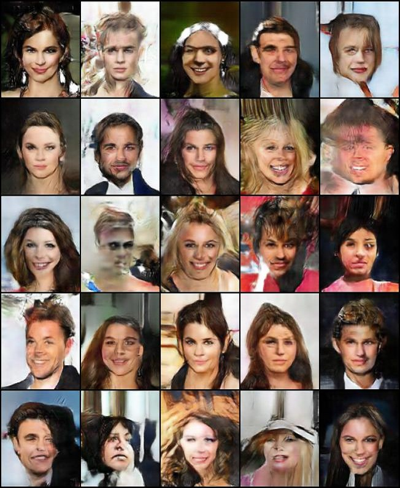
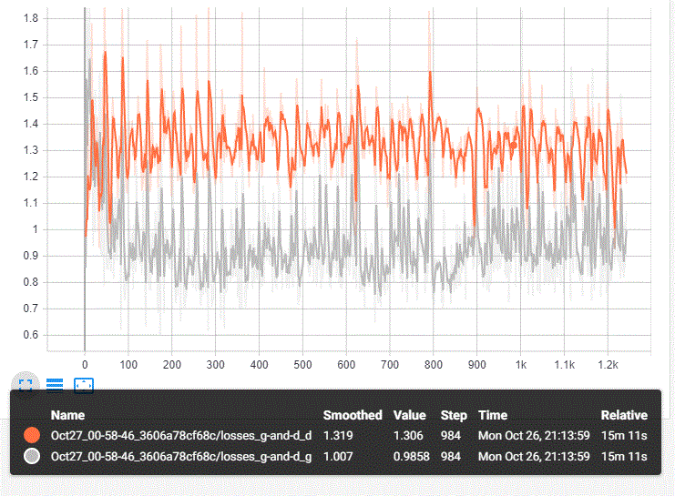

# Advanced DCGAN for Rectangles
An in-depth look at DCGANs, the motivation behind them, and a highly detailed overview of the optimization techniques and tricks necessary to stabilize training between a Generator/Discriminator pair.

## [See Notebook with Exaplantions](https://nbviewer.jupyter.org/github/IliaZenkov/DCGAN-advanced-rectangle/blob/main/notebooks/Advanced_Rectangle_DCGAN.ipynb)
## [Play with it in Google Colab](https://colab.research.google.com/drive/1-oGuHzWq_oOhQYD08ZoH7W1hJCj7oCXR?usp=sharing)

I build a GAN trained on and capable of generating CelebA in original aspect ratio (CelebA aligned: 218x178; 5:4).
It was notably harder to get good-looking rectangular images compared to square images; but tuning the model to accomodate rectangular images is simply a matter of playing with kernel, stride, and padding sizes. 

## 59 Epochs at 157x128

## Lessons Learned: How to Stabilize and Optimize a GAN
- Use Dropout ONLY ON DISCRIMINATOR, and not on final layer of disciriminator. 
- Activation function: In terms of performance for this model, I found LeakyReLU > SELU > ReLU.
- Use Gaussian Instance Noise ONLY ON DISCRIMINATOR.
- Gaussian Instance Noise/Pixel Wise Normalization is not helpful to discriminator when using SpectralNorm + BatchNorm.
- Optimizer: Adam is better than SGD for discriminator, although SGD has been used to slow down the discriminator - but SGD is not necessary with proper discriminator normalization.
- Slowing down discriminator with learning rates and different learning schedule is dubious and rarely works.
- One-sided label smoothing: set discriminator labels for real images from 1 -> 0.9 to make the discriminator's job harder only
- Popular GANHacks GitHub page incorrectly says to smooth both real and fake labels (1->0.9, 0->0.1).
- SpectralNorm is a powerful normalization technique and can be used together with BatchNorm.
- SpectralNorm can replace the normalization power of SELU. 
- batch size: huge batch is much faster to train (1024), but smaller batches train MUCH better GANs.
- batch in radford et al (128) works well; smaller batches (64) work even better but slower to train.
- Use BCELossWithLogits and no sigmoid activation on final discriminator layer: More Stable than BCELoss() due to log of exponential dynamics.
- SELU from HDCGAN paper (SNN): Performed as well as LeakyReLU for this model. SpecNorm+BatchNorm probably means weights are already regularized enough that SELU behaves like LeakyReLU. 
- SELU is self normalizing but I found better to have explicit normalization such as SpecNorm and BatchNorm.
- Adding Gaussian Instance Noise makes discriminator much less sensitive to hyperparams.

## DCGAN Loss Curve Dynamics and Gradients:
#### Well optimized GAN with stable long-term loss curve dynamics and high gradients through all discriminator layers:

#### Poorly Optimized GAN with unstable loss dynamics, vanishing gradients:

