

  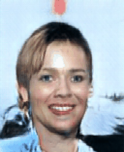
  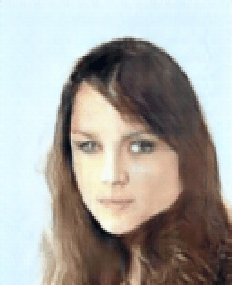
  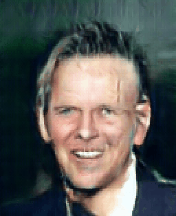
  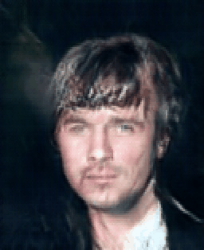
  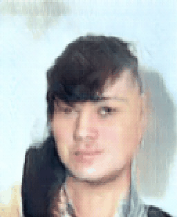  
  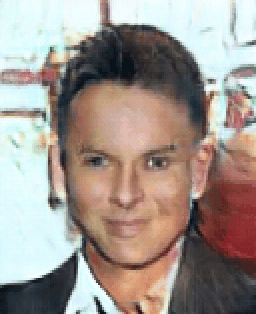
  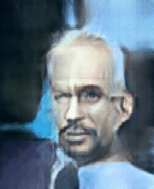
  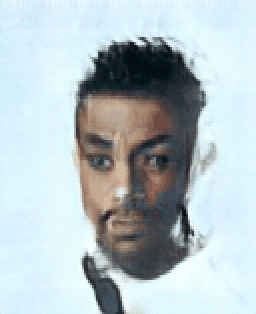
  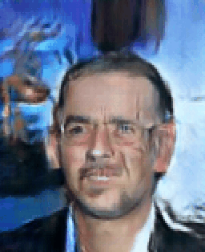
  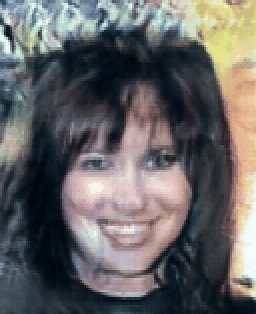

# Advanced Rectangular DCGAN / GAN Hacks 2
An in-depth look at DCGANs, the motivation behind them, and a highly detailed overview of the optimization techniques and tricks necessary to stabilize training between a Generator/Discriminator pair. This is my implementation of [Radford et al, 2015](https://arxiv.org/abs/1511.06434) with the addition of techniques presented in [Improved GAN, Salimans et al 2016](https://arxiv.org/abs/1606.03498), [Spectral Normalization, Miyato et al 2018](https://arxiv.org/abs/1802.05957), and others. I stray from the common path and try to generate sort-of-HD CelebA images in their original, rectangular, 5:4 aspect ratio at 157x128. 

## [See Notebook with Explanations](https://nbviewer.jupyter.org/github/IliaZenkov/DCGAN-Rectangular-GANHacks2/blob/main/DCGAN_rectangular.ipynb)
## [Play with it in Google Colab](https://colab.research.google.com/drive/1x2YM4UELhQtiutyYEkIb1cKlV5KZXPpd?usp=sharing)

I build a GAN trained on and capable of generating CelebA in original aspect ratio.
It was notably harder to get good-looking rectangular images compared to square images; but tuning the model to accomodate rectangular images is simply a matter of playing with kernel, stride, and padding sizes. Getting good-looking results are another story - but I come close using Spectral Normalization, Gaussian Instance Noise, Dropout, one-sided label smoothing, and Scaled Exponential Linear Unit Activation (SELU). 

## Training Progress Over 25 Epochs

Images generated from 100-dimensional latent vectors sampled from a standard Gaussian distribution:

## Lessons Learned: How to Stabilize and Optimize a GAN (or, GAN Hacks 2)
**Training and Failure Modes:**
- Best results are rarely at the last epoch of training - check intermediate epochs, because the generator's output sometimes degrades before picking back up
- When the DCGAN is properly tuned, D loss decreases with time and has low variance.
- When G loss is low or consistently decreases, it's likely fooling D with garbage images.
- Slowing down D with different learning rates as in the TTUR paper sometimes works, but isn't necessary with proper normalization (SpectralNorm + Noise).
- We can actually get away with a 5-10x faster learning rate on D when using all the regularization techniques in this notebook: Spectral Norm + Gaussian Instance Noise + Dropout.
- Slowing down D with altered learning schedule (training D/G in a for loop for each batch) won't avoid training collapse - it'll only delay it.

**Architecture/Hyperparameters:**
- More filters is not better. 512 is a good maximum. 64 filters in each layer of both G and D works decently as well. Other hyperparams appear more important.
- Use Dropout ONLY ON D, and not on its final layer. Using dropout on G leads to poor generated images.
- Use Gaussian Instance Noise ONLY ON D - works well on input or in multiple layers (but not the last layer). Use in G causes it to be unable to generate decent images early on and it never recovers. 
- Adding Gaussian Instance Noise generally made discriminator less sensitive to hyperparameters.
- Gaussian Noise didn't seem to make a big difference to stability of D when using SpectralNorm + BatchNorm.
- SpectralNorm is a powerful normalization technique and can be used together with BatchNorm in G.
- SpectralNorm performed better alone than SpectralNorm + BatchNorm in D. Both improved performance in G.
- SpectralNorm can replace the normalization power of SELU, working well with leakyReLU.
- Large batch is much faster to train (1024), but smaller batches train MUCH better GANs.
- Batch in radford et al (128) works well; smaller batches (64, 32) are more stable but slower to train.

**Activation & Optimizers:**
- Activation function: In terms of performance for this model, I found LeakyReLU+ReLU to lead to faster equillibrium than SELU, though SELU also produced good generated images.
- Use BCELossWithLogits and no sigmoid activation on final discriminator layer: More stable than BCELoss() because of log-sum-exp trick.
- Optimizer: I found AdamW to work better than Adam. AdamW is better than SGD for discriminator, although SGD has been used to slow down the discriminator - it seems SGD slows down D too much with proper discriminator normalization.
- SELU from HDCGAN paper (SNN): Performed as well as LeakyReLU for this model. SpecNorm+BatchNorm probably means weights are already regularized such that SELU behaves similarly to LeakyReLU. 
- SELU is indeed self normalizing, as it produced decent images even without SpectralNorm and BatchNorm - however, I found it better to have explicit normalization such as SpecNorm and BatchNorm and just use LeakyReLU + ReLU. 

**Other tricks:**
- One-sided label smoothing: set discriminator labels for real images from 1 -> 0.9 to make the only the discriminator's job harder.
- Popular GANHacks GitHub page incorrectly says to smooth both real and fake labels (1->0.9, 0->0.1).
- Pixelwise Normalization didn't really change performance, just added complexity. Likely due to Spectral Normalization.
- Minibatch Standard Deviation didn't help much either. Again, likely has to do with Spectral Normalization working so well. 

## DCGAN Loss Curve Dynamics and Gradients:
#### Well optimized GAN with stable long-term loss curve dynamics and high gradients through all discriminator layers:
The discriminator's loss becomes the same on real and fake images, with total Discriminator and Generator loss approaching an equillibrium point. Gradients are of good magnitude throughout the discriminator's layers:

#### Poorly Optimized GAN with unstable loss dynamics, vanishing gradients:
The discrimnator's loss oscillates wildly and will not stabilize as training continues. The Discriminator's gradients are too low for any information gain to pass to the Generator: 

  
  

## Bonus 

 I call this piece the "Interpolated Circle of Death" 

                                                                       

  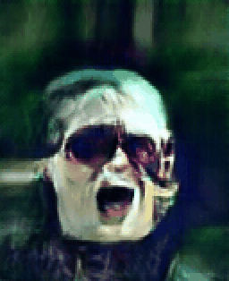
  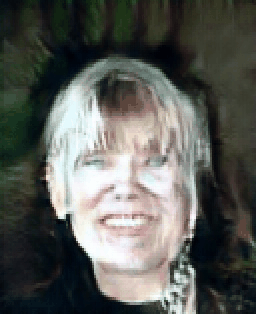

 And a rather humorous example of mode collapse: 

            

  

# References
- Arjovsky and Bottou, 2017. Towards Principled Methods for Training Generative Adversarial Networks. https://arxiv.org/abs/1701.04862
- Arjovsky et al, 2017. Wasserstein GAN. https://arxiv.org/abs/1701.07875 
- Curto et al, 2020. High-resolution Deep Convolutional Generative Adversarial Networks. https://arxiv.org/pdf/1711.06491.pdf
- Dumoulin and Visin, 2018. A guide to convolution arithmetic for deep learning. https://arxiv.org/pdf/1603.07285.pdf
- Goodfellow et al, 2014. Generative Adversarial Networks. https://arxiv.org/abs/1406.2661
- Heusel et al, 2017. GANs Trained by a Two Time-Scale Update Rule Converge to a Local Nash Equilibrium. https://arxiv.org/abs/1706.08500
- Jenni and Favaro, 2019. On Stabilizing Generative Adversarial Training with Noise. https://arxiv.org/abs/1906.04612
- Karras et al, 2017. Progressive Growing of GANs for Improved Quality, Stability, and Variation. https://arxiv.org/abs/1710.10196
- Klambauer et al, 2017. Self-Normalizing Neural Networks. https://arxiv.org/abs/1706.02515
- Liu et al, 2016. Large-scale CelebFaces Attributes (CelebA) Dataset. http://mmlab.ie.cuhk.edu.hk/projects/CelebA.html
- Mescheder et al, 2018. Which Training Methods for GANs do actually Converge? https://arxiv.org/pdf/1801.04406.pdf
- Miyato et al, 2018. Spectral Normalization for Generative Adversarial Networks. https://arxiv.org/abs/1802.05957
- Radford et al, 2015. Unsupervised Representation Learning with Deep Convolutional Generative Adversarial Networks. https://arxiv.org/abs/1511.06434
- Salimans et al, 2016. Improved Techniques for Training GANs. https://arxiv.org/pdf/1606.03498.pdf
- Sonderby et al, 2016. Amortised MAP Inference for Image Super-resolution. https://arxiv.org/abs/1610.04490
